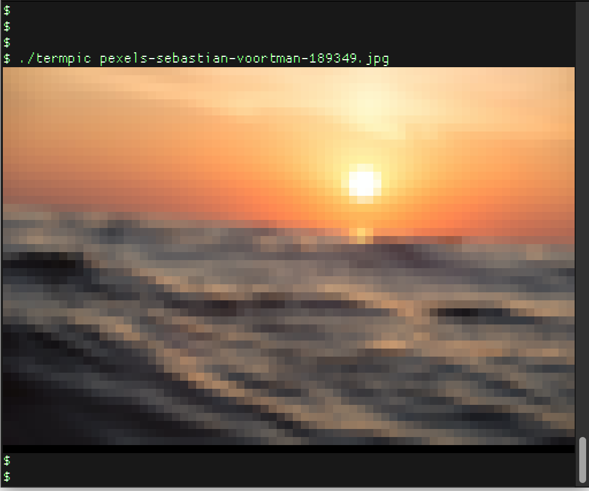

# termpic

Displays an image rendered full-color in modern terminals.  Most common 
image formats are supported.

The image is resized to fit the current terminal by default.  For more sizing options (and other options) see the help text.

Transparent images are also kinda supported.

